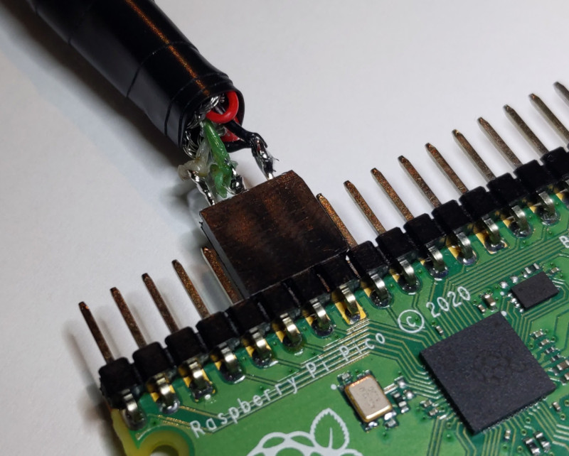
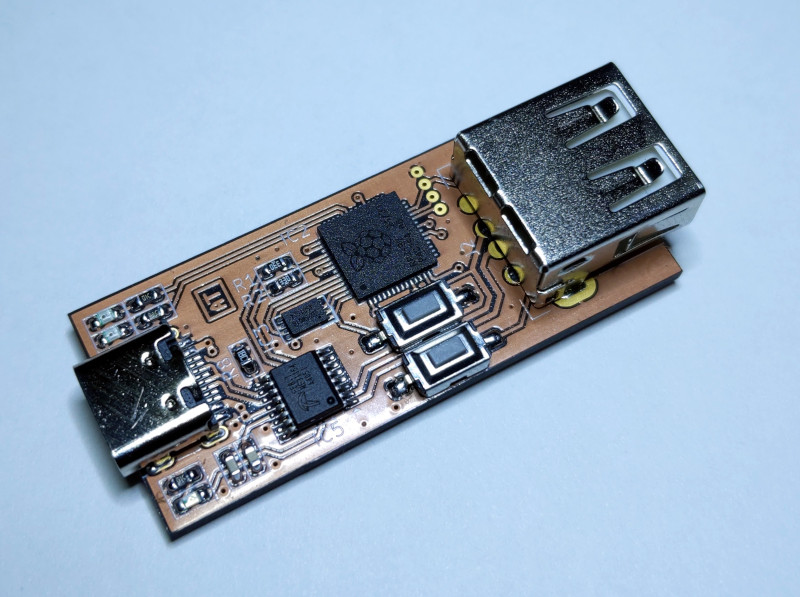

# Usb Sniffer Lite for RP2040

This is a simple USB sniffer based on a Raspberry Pi RP2040. It supports Low Speed and
Full Speed modes.

The firmware presents itself as a virtual COM-port (VCP), so no additional software
is necessary and it is compatible with all operating systems.

Here are a couple of example capture logs for the [enumeration](doc/usb_fs_enumeration.txt)
and a regular [data transfer](doc/usb_fs_data.txt).

The compiled binary is available [here](bin/UsbSnifferLite.uf2). Boot RP2040 into
the BootROM mode and copy the UF2 file to the drive.

This sniffer has no packet decoding capabilities, but there is an excellent online
[USB Descriptor and Request Parser](https://eleccelerator.com/usbdescreqparser/)
that is very helpful with decoding of the standard descriptors and requests.

The compiled binary needs to have CRC value updated to be recognized by the RP2040.
This can be done using [this](https://github.com/ataradov/tools/tree/master/bin2uf2) tool.

## Hardware Connections

USB D+ and D- signals can be directly connected to the MCU pins. The default
pin assignments are shown in the following table:

| RP2040 Pin | Function | USB Cable Color |
|:-------:|:----------------:|:-----:|
| GND     | Ground           | Black |
| GPIO 10 | D+               | Green |
| GPIO 11 | D-               | White |
| GPIO 12 | Start (internal) | N/A   |
| GPIO 18 | Trigger          | N/A   |
| GPIO 25 | Status LED       | N/A   |
| GPIO 26 | Error LED        | N/A   |

The easiest way to connect the signals to the Raspberry Pi Pico board is to splice
the USB cable. It does not have to be pretty. Below is a picture of a cable that
took less than 10 minutes to make. Feel free to make it prettier.

[Here](doc/Hardware.md) are some pictures of a cleaner version based on
the [custom breakout board](https://github.com/ataradov/breakout-boards/tree/master/rp2040).

Trigger input is internally pulled up and the active level is low. When trigger is
enabled in the settings, the capture would pause until the trigger pin is pulled low.
Given the limited size of the capture buffer, trigger mechanism provides a way for
the debugged target to mark the part of interest.

## Dedicated Hardware

There is now a dedicated board. It integrates FE8.1 USB HUB, so you only need one
connection to the host PC. This simplifies setup a lot and eliminates wiring mess
that usually happens when working with USB sniffers.

Normally it is not advised to use the same host port for the sniffer and the target device,
but since in this case only USB Low Speed and Full Speed modes are supported, there
is plenty of bandwidth for both devices.

Schematics and Gerber files are available in the [hardware](hardware/) directory.

## Settings

The following settings are supported:

* Capture speed (e) -- Low / Full
* Capture trigger (g) -- Enabled / Disabled
* Capture limit (l) -- 100/200/500/1000/2000/5000/10000 packets / Unlimited
* Time display format (t) -- Relative to the first packet / previous packet / SOF / bus reset
* Data display format (a) -- Full / Limit to 16 bytes / Limit to 64 bytes / Do not display data
* Fold empty frames (f) -- Enabled / Disabled

A frame is delimited by the SOF packet in the Full Speed mode or by a keep-alive signal in
the Low Speed mode.

An empty frame is a frame that contains no packets other than IN/NAK and contains no packets
with errors detected. Folding of the empty frames shortens the displayed information by
combining consecutive empty frames into one entry, since they don't carry useful information,
but happen very often in a typical USB transaction.

## Commands

The following commands are supported:

* Print the help message (h)
* Display current buffer (b)
* Start capture (s)
* Stop capture (p)

Once capture is started and the trigger condition is met, the sniffer captures the specified
number of packets. After the capture is done, the buffer is displayed using current settings.

The display settings may be adjusted without a new capture. Once the buffer is captured,
it is stored in the memory and can be displayed again using a `b` command.
