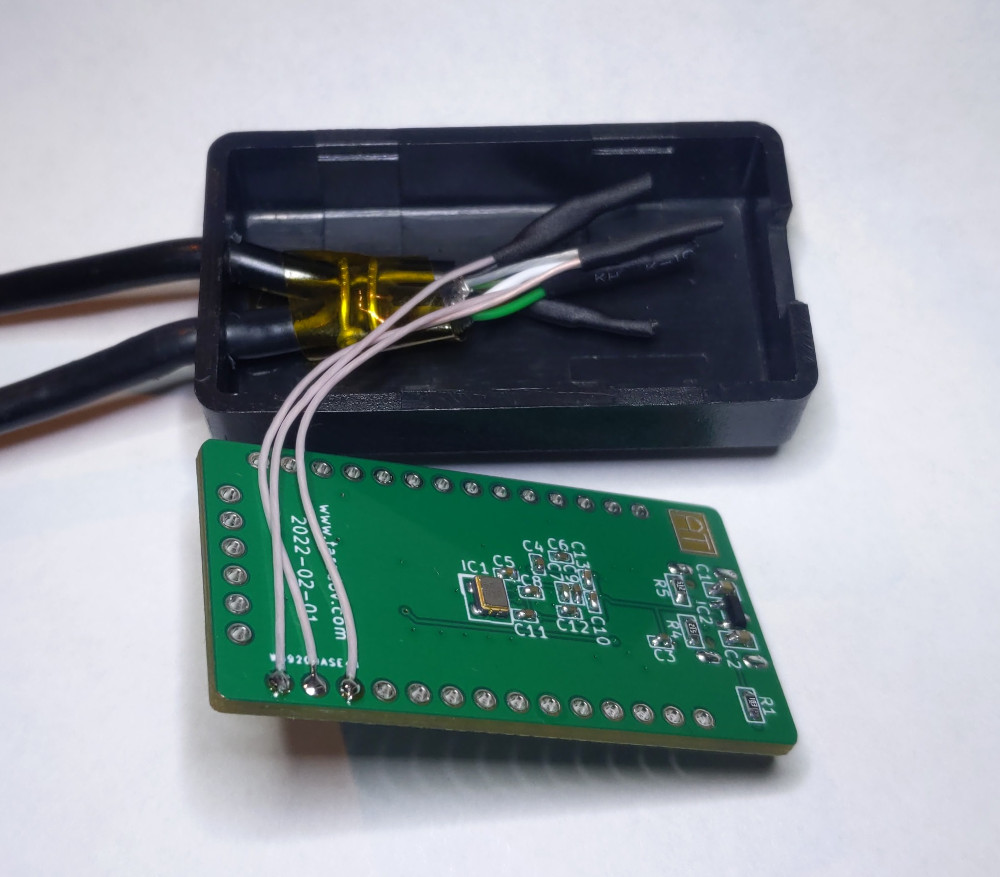
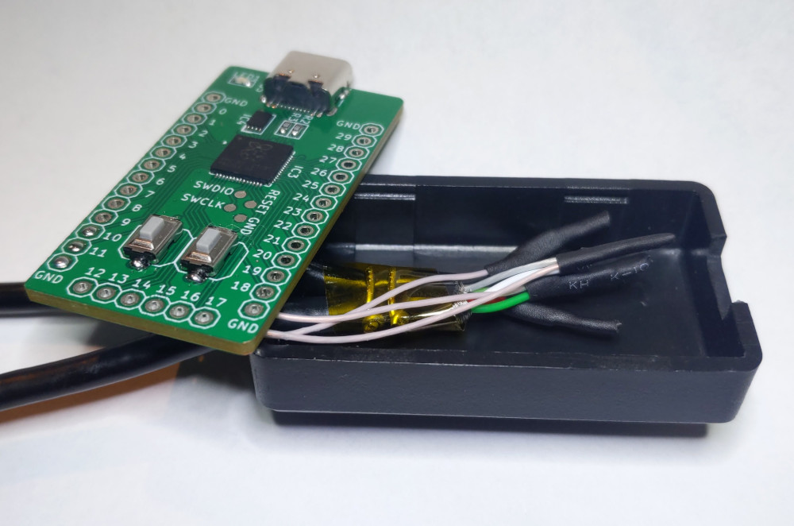
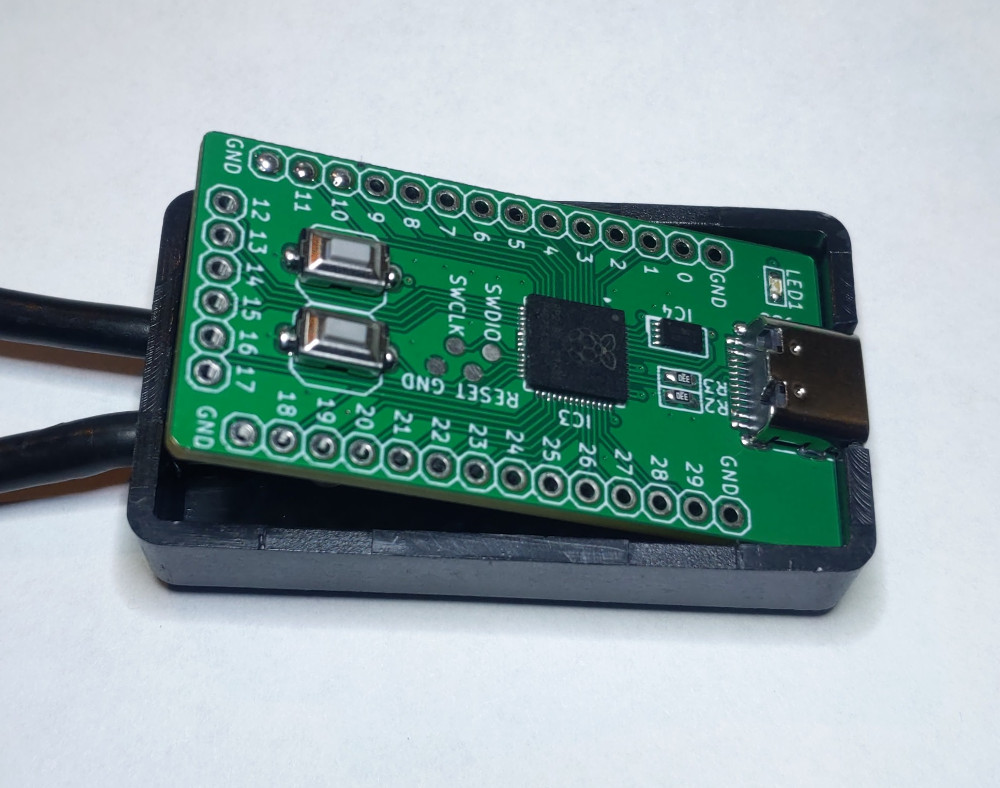
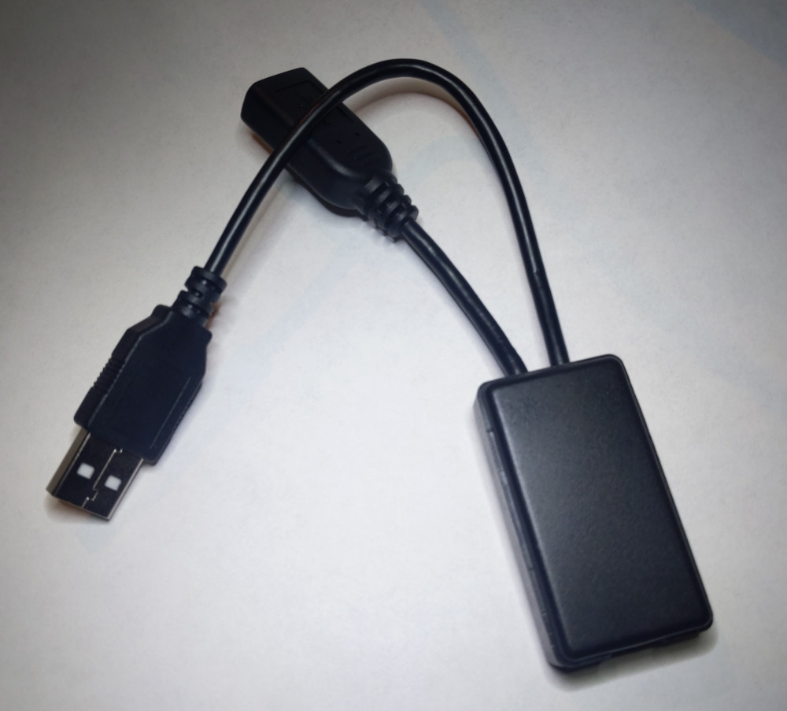

# Custom hardware version

This is the hardware based on the [custom breakout board](https://github.com/ataradov/breakout-boards/tree/master/rp2040):

This uses a standard project box you can find on eBay or Aliexpress.
The suppliers change a lot, but usually you can find it by its dimensions: 1.97 x 1.1 x 0.59 inch / 50 x 28 x 15 mm.
